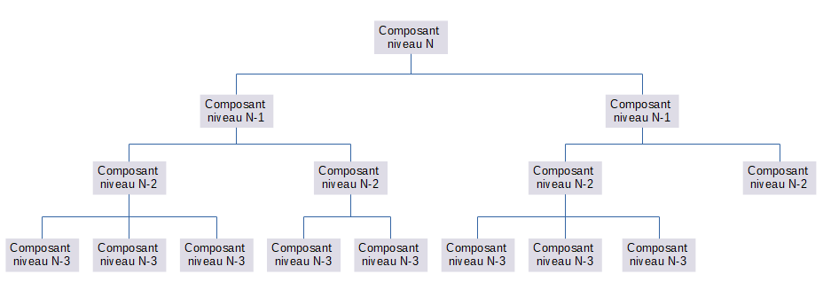

# Separation of Concerns (SoC)

## Introduction
Lors d'un cours ou d'une formation, l'enseignant formateur présente les principaux concepts du développement logiciel.
Ces concepts très utiles sont souvent abordés brièvement, et il est donc difficile de les appréhender complètement.
Alors on se promet d'y revenir plus tard lorsque l'on aura un peu plus d'expérience.
Et puis on oublie...

Cet article se veut un petit retour sur un de ces concepts : "Separation of concerns" ou "séparation des 
responsabilités". 
Pour cela, il est nécessaire de présenter d'abord le concept et sa déclinaison dans l'informatique. 
Comme l'article porte sur la programmation, des exemples d'application du concept sur du code seront détaillés.


## Concept

Le concept de **Separation of Concerns** ou **SoC** a été décrit par E.W. Dijkstra dans l'article 
*On the role of scientific thought*(L1) publié en 1974 et dont voici l'extrait sur le sujet :

> Let me try to explain to you, what to my taste is characteristic for all intelligent thinking. It is, that one is
> willing to study in depth an aspect of one's subject matter in isolation for the sake of its own consistency, all 
> the time knowing that one is occupying oneself only with one of the aspects. We know that a program must be correct
> and we can study it from that viewpoint only; we also know that it should be efficient and we can study its
> efficiency on another day, so to speak. In another mood we may ask ourselves whether, and if so: why, the program
> is desirable. But nothing is gained —on the contrary!— by tackling these various aspects simultaneously. It is what
> I sometimes have called "the separation of concerns", which, even if not perfectly possible, is yet the only
> available technique for effective ordering of one's thoughts, that I know of. This is what I mean by "focusing one's
> attention upon some aspect": it does not mean ignoring the other aspects, it is just doing justice to the fact that
> from this aspect's point of view, the other is irrelevant. It is being one- and multiple-track minded simultaneously.


En développement logiciel, la *séparation des responsabilités* vise à découper un programme en un ensemble de 
sous-programmes où chaque sous-programme a la responsabilité de traiter un aspect du programme. 
Il en est de même pour chaque sous-programme qui est divisé en *composants* et ainsi de suite.

D'un premier abord, cette découpe paraît simple, cependant la vraie difficulté de tout cela réside dans la façon de 
découper.
En effet, il faut attribuer à chaque composant d'un niveau une responsabilité claire, et à chaque composant de 
niveau inférieur, il faut donner un morceau de la responsabilité supérieure tout en s'assurant que toutes ces 
responsabilités de niveau inférieur sont cohérentes entre elles. Et ainsi de suite à chaque niveau. 



Il faut que chaque composant de la construction ait une responsabilité claire, cohérente et sans duplication
avec les autres.
Il s'agit là d'une tâche ardue.

## Application du concept en informatique
En langage Java, la subdivision des composants est la suivante
* application
* module (ie le concept introduit dans Java 9)
* package
* class
* method

Cela signifie qu'une *application* est composée d'un ou plusieurs *module*, que chaque *module* est composé d'un ou plus 
*package*, que chaque *package* est composé d'une ou plusieurs *class*, que chaque *class* est composée d'une ou 
plusieurs *method*.

Bien entendu, cette division est déclinable à différentes échelles. 
Ainsi pour un système logiciel _simplifié_, cette division est :
* système
* sous-système
* application
* etc

Les exemples des chapitres suivants présentent des cas concrets de code ne respectant pas le principe de la séparation
des responsabilités, une analyse des problèmes qui en découlent et une proposition de résolution de ces problèmes à l'aide
de l'application du principe. 

Il est important de conserver en mémoire les points suivants à propos des exemples : 
* leur taille est restreinte afin de limiter la longueur de l'article. 
* les interfaces/classes utilisées comme dépendances (ie fournisseur de service) sont supposées externes au projet (API)
  et donc non modifiables
* les types de bases sont fortement typés afin de clarifier au maximum le code
* les commentaires ont été supprimés dans les exemples pour en réduire leur longueur

## Exemple d'application 1 : séparation des sujets

Cet exemple illustre l'application du concept pour distinguer les sujets traités en un ensemble de composants traitant 
chacun un seul et unique sujet. 

Le code de cet exemple est basé sur un service de gestion de bibliothèque. 
Ce service est représenté par l'interface **LibraryService** contenant un ensemble de méthodes de gestion d'une 
bibliothèque. 


### Situation initiale

Dans la situation initiale, l'ensemble des méthodes est placé dans la même interface.
Ce cas peut se produire lors de la définition trop rapide d'un service, ou suite à de nombreuses évolutions
incontrôlées du service.


Ce service contient toutes les méthodes possibles pour gérer la bibliothèque :
* Inscrire un nouvel adhérent
* Emprunter un livre
* Ramener un livre
* Obtenir la liste des livres
* Obtenir la liste des adhérents
* etc.


````java
public interface LibraryService {

    Set<Book> getAllBooks();

    void registerClient(Client client) throws ClientAlreadyRegisteredException;

    void borrowBook(Book book) throws UnknownBookException, BookAlreadyBorrowedException;

    Set<Client> getClientsWithBorrowedBooks();

    void registerBook(Book book) throws BookAlreadyRegisteredException;

    boolean isBookRegistered(Book book);

    void returnBook(Book book) throws UnknownBookException, BookAlreadyReturnedException;

    boolean isClientRegistered(Client client);

    void unregisterClient(Client client) throws UnknownClientException;

    void unregisterBook(Book book) throws UnknownBookException;

    boolean isBookBorrowed(Book book);

    Set<Book> getBooksBorrowedByClient(Client client) throws UnknownClientException;

    Set<Book> getAvailableBooks();

    Set<Client> getAllClients();
}
````


### Analyse de la situation initiale 
Une première observation rapide permet de constater que ce service est constitué de près d'une quinzaine de méthodes. 
Ce qui en fait un service plutôt étoffé, et son implémentation doit être volumineuse, voire complexe.

Une observation plus détaillée du service permet de constater que les méthodes portent sur des entités différentes 
(livres, clients, emprunts) et portent sur des tâches métier différentes (récupération, enregistrement, vérification, 
etc.). 
Cela implique que l'implémentation sera complexe à écrire et à lire, car chaque méthode pourra avoir un contexte très
différent de la suivante.

De plus, la réutilisabilité du service sera fortement limitée car il faudra reprendre l'ensemble des méthodes.
Par exemple, si l'on souhaite réutiliser cette interface pour gérer simplement une collection de livres, cela impliquera
soit d'y incorporer le concept de client et d'emprunt, soit de neutraliser l'usage de ces méthodes (par exemple en 
levant une exception *java.lang.UnsupportedOperationException*).


Bref, cette version du service fonctionne mais elle ne sera pas très aisée à utiliser, ni à implémenter. 
Par voie de conséquence, elle est plus difficile à maintenir et à faire évoluer.

### Application du principe du SoC
En appliquant le principe du *Separation of Concerns*, il est possible d'améliorer la situation.
Cette interface contient trois notions métiers : le livre, le client et l'emprunt.
Ainsi il est possible de diviser le service LibraryService en trois services :
* **BookService** : un service de gestion des livres
* **ClientService** : un service de gestion des adhérents
* **BorrowingService** : un service de gestion des emprunts


#### Classe BookService
Cette interface regroupe les méthodes liées à la gestion des livres au niveau global de la bibliothèque.
```java
public interface BookService {

    Set<Book> getAllBooks();

    void registerBook(Book book) throws BookAlreadyRegisteredException;

    boolean isBookRegistered(Book book);

    void unregisterBook(Book book) throws UnknownBookException;
    
}
``` 


#### Classe BorrowingService
Cette interface regroupe les méthodes liées à la gestion de l'emprunt et du retour des livres

```java
public interface BorrowingService {

    Set<Book> getAvailableBooks();

    void borrowBook(Book book) throws UnknownBookException, BookAlreadyBorrowedException;

    Set<Client> getClientsWithBorrowedBooks();

    void returnBook(Book book) throws UnknownBookException, BookAlreadyReturnedException;

    boolean isBookBorrowed(Book book);

    Set<Book> getBooksBorrowedByClient(Client client) throws UnknownClientException;
}
```


#### Classe ClientService
Cette interface regroupe les méthodes liées à la gestion des adhérents. 
```java
public interface ClientService {

    void registerClient(Client client) throws ClientAlreadyRegisteredException;

    boolean isClientRegistered(Client client);

    void unregisterClient(Client client) throws UnknownClientException;

    Set<Client> getAllClients();
}
```


### Conclusion
Suite au refactoring, chacun des services est dédié à un seul et unique sujet, et contient toutes les opérations qui lui
sont relatives.
Ainsi BookService regroupe toutes les opérations liées aux livres : ajout, suppression, liste, etc.
Il en est de même pour ClientService qui est un service dédié à la gestion des adhérents.
Le service BorrowingService est dédié à la gestion des emprunts, c'est-à-dire sur les relations entre un adhérent et
un livre.

Chaque interface porte sur un périmètre clair et restreint.
L'usage, l'implémentation et la maintenance de chacune en sont facilités.


## Exemple d'application 2 : diminuer la complexité du code

Le principe de séparation des responsabilités peut s'appliquer à l'implémentation d'une méthode pour la rendre plus 
lisible.
Il s'agit de faire en sorte que chaque ligne de code de la méthode fasse une seule et unique chose. Pour cela il 
existe plusieurs stratégies, dont les plus usitées sont :
* créer une méthode regroupant le code portant sur le même sujet
* nommer des variables avec un nom explicite
* faciliter la réutilisation en créant des méthodes qui font une action précise clairement décrite par leur nom.

### Situation initiale
La classe BorrowingService contient une méthode *isMaximumBookBorrowed* qui indique que le nombre de livres, empruntés 
par le client, est au maximum.

Voici la première implémentation :
```java
public class BorrowingService {

    private static final int MAX_BORROWED_BOOK_COUNT = 5;
    private ClientService clientService;
    private final Map<Client, Set<Book>> borrowedBookMap = new HashMap<>();

    public boolean isMaximumBookBorrowed(Client client) {
        notNull(client, "client argument shall not be null");

        if (!clientService.isRegisteredClient(client))
            throw new UnknownClientException("Client " + client + " is not registered in the library");

        Set<Book> borrowedBookSet = borrowedBookMap.getOrDefault(client, Collections.emptySet());
        int borrowedBookCount = borrowedBookSet.size();
        return borrowedBookCount >= MAX_BORROWED_BOOK_COUNT;
    }
}
```

### Analyse de la situation initiale

Le code est relativement lisible mais il est nécessaire de le lire avec attention pour en deviner les différentes 
étapes :
* La vérification du client
   * la non nullité du paramètre client
   * l'enregistrement effectif du client à la bibliothèque
* L'obtention du nombre d'ouvrages empruntés par le client
   * L'obtention de la liste des ouvrages empruntés par le client
   * Le comptage de ces ouvrages
* La comparaison du nombre d'ouvrages empruntés par le client avec le nombre maximum d'ouvrages empruntables.

Cette méthode est correctement codée, pas trop longue et passe sans soucis les outils de qualimétrie automatique.

Cependant la lisibilité n'est pas optimale et peut amener à des erreurs lors de sa modification. 
C'est là que le principe de SoC peut aider.


### Application du principe du SoC

L'application du SoC dans cet exemple vise à découper cette méthode en plusieurs méthodes, chacune portant une 
responsabilité distincte des autres.

Comme noté dans l'analyse de la section précédente, il y a 3 notions essentielles :
* la vérification du client
* l'obtention du nombre d'ouvrages empruntés par le client
* La comparaison du nombre d'ouvrages empruntés par le client avec le nombre maximum d'ouvrages empruntables

Le refactoring consiste à disposer d'une méthode par notion :
* la méthode *isMaximumBookBorrowed(Client)* est la méthode analysée, son périmètre n'évolue pas, seule son implémentation change.
* la méthode *verifyClientRegistered(Client)* est en charge de la vérification du client. Elle vérifie 2 choses :
   * que l'argument client n'est pas *null*,
   * que le client est enregistré auprès de la bibliothèque.
* la méthode *getBorrowedBookCount(Client)* fournit le nombre de livres empruntés par le client. 


```java
public class BorrowingService2 {

    private static final int MAX_BORROWED_BOOK_COUNT = 5;
    private ClientService clientService;
    private final Map<Client, Set<Book>> borrowedBookMap = new HashMap<>();


    public boolean isMaximumBookBorrowed(Client client) {
        verifyClientRegistered(client);
        return getBorrowedBookCount(client) >= MAX_BORROWED_BOOK_COUNT;
    }

    
    private void verifyClientRegistered(Client client) {
      notNull(client, "client argument shall not be null");
      if (!clientService.isRegisteredClient(client))
        throw new UnknownClientException("Client " + client + " is not registered in the library");
    }

  
    private int getBorrowedBookCount( Client client) {
        Set<Book> borrowedBookSet = borrowedBookMap.getOrDefault(client, Collections.emptySet());
        return borrowedBookSet.size();
    }
}
```


### Conclusion
L'application du principe SoC a permis de faire ressortir la logique du code dans cet exemple et d'identifier les sujets
traités dans la méthode.

La nouvelle version du code contient 3 méthodes au lieu d'une seule. Les 2 méthodes supplémentaires sont concises, claires
et portent sur une seule action. 
Outre le fait d'obtenir une méthode plus claire, ce refactoring permet d'avoir deux nouvelles méthodes réutilisables.
Il faut souligner que les méthodes ajoutées sont internes à l'implémentation et n'impactent pas l'interface.


L'usage, l'implémentation et la maintenance de ce code sont facilités.


## Exemple d'application 3 : mélange fonctionnel et technique

Le principe de la séparation des responsabilités s'applique également sur le découpage du code pour distinguer le code 
fonctionnel du code technique.
* Le code fonctionnel est du code qui décrit le métier de l'application, en ne manipulant que des objets métiers.
Ainsi il doit être compréhensible par un utilisateur. 
* En revanche, le code technique utilise des objets et des API de bas niveau. 


### Situation initiale

La méthode *borrowBook(Book,Client)* permet à un client d'emprunter un livre de la bibliothèque.
Voici les principales étapes qui la composent :
* vérifier que le livre existe dans la bibliothèque et n'a pas été déjà emprunté.
* vérifier que le client est enregistré auprès de la bibliothèque
* enregistrer que le livre a été emprunté par le client 

````java
public class LibraryService {

  private final Set<Book> bookSet = new HashSet<>();
  private final Set<Client> clientSet = new HashSet<>();
  private final Map<Client, Set<Book>> borrowedBookMap = new HashMap<>();

  public void borrowBook(Book book, Client client) throws UnknownBookException, UnknownClientException, BookAlreadyBorrowedException {
    notNull(book, "book argument shall not be null");
    notNull(client, "client argument shall not be null");

    if (!clientSet.contains(client))
      throw new UnknownClientException("Client " + client + " is not registered in the library");

    if (!bookSet.contains(book))
      throw new UnknownBookException("Book " + book + " is not registered in the library");

    if (borrowedBookMap.containsKey(client) && borrowedBookMap.get(client).contains(book))
      return;

    boolean bookBorrowed = borrowedBookMap.values().stream()
            .flatMap(Collection::stream)
            .anyMatch(it -> it.equals(book));
    if (bookBorrowed)
      throw new BookAlreadyBorrowedException("Book " + book + " has already been registered");

    if (!borrowedBookMap.containsKey(client))
      borrowedBookMap.put(client, new HashSet<>());

    Set<Book> borrowedBookSet = borrowedBookMap.get(client);
    borrowedBookSet.add(book);
  }
  
}
````

### Analyse de la situation initiale

L'implémentation initiale est correctement codée, de taille moyenne et passe les outils de qualimétrie automatique.
Cette implémentation, bien que s'exécutant parfaitement, est peu lisible et mélange du code fonctionnel avec du code 
technique. 
Par exemple l'usage de l'API stream en plein milieu casse complètement la lecture. Déterminer le processus 
fonctionnel contenu dans la méthode est difficile et demande une bonne concentration. 
En résumé, la compréhension et la maintenabilité de ce morceau de code sont médiocres. 


### Application du principe du SoC

L'application du *Separation of Concern* consiste à faire apparaitre clairement le code fonctionnel dans la fonction et
à déléguer les parties techniques dans d'autres fonctions.

D'un point de vue fonctionnel, le contenu de la méthode est:
* vérifier que l'emprunteur est client de la bibliothèque
* vérifier que le livre est enregistré dans la bibliothèque
* vérifier que le livre n'est pas déjà emprunté 
  * par l'emprunteur lui-même
  * par un autre client de la bibliothèque
* déclarer le livre comme emprunté par l'emprunteur


D'un point de vue technique, les méthodes ajoutées sont les implémentations des méthodes utilisées dans la partie 
fonctionnelle. 
Chacune porte sur un sujet précis et indépendant des autres.


```java
public class LibraryService2 {

  private final Set<Book> bookSet = new HashSet<>();
  private final Set<Client> clientSet = new HashSet<>();
  private final Map<Client, Set<Book>> borrowedBookMap = new HashMap<>();


  public void borrowBook(Book book, Client client) {
    verifyRegisteredClient(client);
    verifyRegisteredBook(book);

    if (isBookBorrowedByClient(book, client))
      return;

    verifyBookNotBorrowed(book);

    addBookToClient(book, client);
  }


  private void verifyRegisteredClient(Client client) {
    notNull(client, "client argument shall not be null");
    if (!clientSet.contains(client))
      throw new UnknownClientException("Client " + client + " is not registered in the library");
  }


  private void verifyRegisteredBook(Book book) {
    notNull(book, "book argument shall not be null");
    if (!bookSet.contains(book))
      throw new UnknownBookException("Book " + book + " is not registered in the library");
  }


  private boolean isBookBorrowedByClient(Book book, Client client) {
    Set<Book> borrowedBookSet = borrowedBookMap.getOrDefault(client, Collections.emptySet());
    return borrowedBookSet.contains(book);
  }


  private void verifyBookNotBorrowed(Book book) {
    if (isBorrowedBook(book))
      throw new BookAlreadyBorrowedException("Book " + book + " has already been registered");
  }

  
  private boolean isBorrowedBook(Book book) {
    return borrowedBookMap.values().stream()
            .flatMap(Collection::stream)
            .anyMatch(it -> it.equals(book));
  }


  private void addBookToClient(Book book,Client client) {
    Set<Book> borrowedBookSet = getBooksBorrowedByClient(client);
    borrowedBookSet.add(book);
  }


  private Set<Book> getBooksBorrowedByClient(Client client) {
    if (!borrowedBookMap.containsKey(client))
      borrowedBookMap.put(client, new HashSet<>());

    return borrowedBookMap.get(client);
  }
}
```


### Conclusion
La nouvelle version contient 8 méthodes au lieu d'une seule dans la version initiale.
Ces nouvelles méthodes sont concises, claires et facilement réutilisables.
La méthode fonctionnelle *borrowBook* est constituée uniquement de code fonctionnel et sa lisibilité est immédiate.
Elle peut même être comprise par une personne qui n'est pas développeur.

Le pendant de cette simplicité du contenu de chaque méthode est la complexité croissante de l'implémentation par la 
multiplication du nombre de méthodes. 
C'est un problème inhérent au développement et est un sujet de discussion récurrent entre les développeurs :
petites méthodes simples mais nombreuses contre grosses méthodes rares mais complexes.
Bien entendu, il n'y a pas de réponse tranchée à ce sujet.
Le tout est une question d'équilibre en se focalisant d'abord sur la lisibilité du code. 
Il est impératif que chaque méthode créée possède un périmètre clair et que son nom le reflète exactement.
En d'autres termes, il faut que chacune de ces méthodes soit simple.
Or, la simplicité est complexe à créer et il ne faudra pas hésiter pas à passer du temps pour concevoir ces refactorings,
tant du point de vue de l'implémentation que de la dénomination des méthodes.


En bref, l'usage, l'implémentation, la réutilisation et la maintenance du code sont facilités.


## Exemple d'application 4 : Séparation de couches

La séparation des responsabilités s'applique également au niveau de l'architecture. 
Selon sa nature, une architecture est décomposée en couches ou en composants (ex : les bases de données).
Dans la suite du chapitre, afin de simplifier la lecture, il sera question uniquement du cas de l'architecture en couche, mais 
tous les principes présentés s'appliquent de la même façon à une architecture en composants.

Chaque couche doit avoir une responsabilité précise et il est nécessaire d'avoir le bon niveau de séparation des couches 
afin de favoriser la réutilisation et la maintenance.


### Situation initiale

Pour illustrer cette nécessité, voici un exemple d'un service REST fournissant la liste des titres des livres disponibles
dans la bibliothèque.
L'implémentation de ce service REST se fait en plusieurs temps :
* le calcul des livres disponibles à l'emprunt, le résultat est fourni au format métier 
* Renvoi d'une réponse "204 Not Found" si aucun livre n'est disponible
* Conversion de la liste des livres disponibles au format technique (ie le format JSON utilisé par défaut en REST)
* Renvoi d'une réponse OK avec la liste des livres au format technique


```java
public class LibraryRestService {

    private BookService bookService;
    private final Map<Client, Set<Book>> borrowedBookMap = new HashMap<>();

    @GetMapping("/books/available")
    public ResponseEntity<List<BookJson>> getAvailableBooks() {
        Set<Book> availableBookSet = getAvailableBookSet();
        if( availableBookSet.isEmpty())
            return ResponseEntity.noContent().build();

        List<BookJson> orderedJsonBookList = toJson(availableBookSet);
        return ResponseEntity.ok(orderedJsonBookList);
    }

    
    private Set<Book> getAvailableBookSet() {
        Set<Book> borrowedBookSet = borrowedBookMap.values().stream()
                .flatMap(Collection::stream)
                .collect(Collectors.toSet());
        Set<Book> availableBookSet = new HashSet<>(bookService.getAllBooks());
        availableBookSet.removeAll(borrowedBookSet);
        return availableBookSet;
    }

    
    private static List<BookJson> toJson(Collection<Book> availableBookSet) {
        return availableBookSet.stream()
                .map(LibraryService::toJson)
                .sorted(Comparator.comparing(BookJson::getTitle))
                .collect(Collectors.toList());
    }

    
    private static BookJson toJson(Book book) {
        BookJson jsonBook = new BookJson();
        jsonBook.setAuthor(book.getAuthor());
        jsonBook.setPublisher(book.getPublisher());
        jsonBook.setTitle(book.getTitle());
        return jsonBook;
    }
}
```

### Analyse de la situation initiale

Le code est de bonne qualité, les méthodes sont concises et claires. 
Mais il y a tout de même un cas où le code n'est pas optimal.

Imaginons que le service de fourniture de la liste des livres doive être aussi disponible sous un autre protocole (XMPP, 
SOAP, ...) ou sous une nouvelle version (ex: nouveau path avec contenu au format CSV ou XML ou JSON différent, etc.).
Attention, il ne s'agit pas du remplacement du service existant mais de l'ajout d'un service équivalent joignable via un
moyen technique différent.
Comme ce nouveau service sera dans une autre classe dédiée (Application du **SoC**), par exemple *LibrarySoapService*, 
il faudra dupliquer une partie du code de *LibraryRestService* :
* la méthode *getAvailableBookSet()* à dupliquer systématiquement
* les méthodes *toJson* à dupliquer si le format technique des données est le même.

Il est à noter que la méthode *getAvailableBookSet()* diffère des autres car son implémentation qui est purement métier, 
alors que les autres méthodes sont des méthodes techniques liées au protocole REST.

Bref, ce code n'est pas suffisamment réutilisable. 


### Application du principe du SoC
Comme vu dans l'analyse, la réutilisation n'est pas optimale pour deux raisons : 
* l'insertion de code métier (*getAvailableBookSet()*) dans du code technique
* l'insertion de code de formatage de données dans du code de service

Le mélange de code métier et technique est résolu en déplaçant ce code dans un couple interface / classe 
d'implémentation.

Le mélange code de service et code de formatage est résolu par le déplacement du code de formatage dans une classe 
finale de type *helper*.

#### La couche métier
La couche métier, qui reprend le code de la méthode *getAvailableBooks()* est composée de l'interface ModelLibraryService2 
et d'une classe d'implémentation ModelLibraryService2Impl 

```java
public interface ModelLibraryService2 {
    Set<Book> getAvailableBooks();
}
```

```java
public class ModelLibraryService2Impl implements ModelLibraryService2 {

    private BookService bookService;
    private final Map<Client, Set<Book>> borrowedBookMap;

    @Override
    public Set<Book> getAvailableBooks() {
        Set<Book> borrowedBookSet = getBorrowedBooks();
        Set<Book> allBooks = bookService.getAllBooks();
        Set<Book> availableBookSet = new HashSet<>(allBooks);
        availableBookSet.removeAll(borrowedBookSet);
        return availableBookSet;
    }

    private Set<Book> getBorrowedBooks() {
        return borrowedBookMap.values().stream()
                .flatMap(Collection::stream)
                .collect(Collectors.toSet());
    }
}
```


#### La couche REST
La couche REST dépend de la couche métier à laquelle elle accède via l'interface *ModelLibraryService2*.
La conversion des objets métier en REST est déportée dans la classe *BookJsonHelper*. 

```java
public class LibraryRestService2 {

    private ModelLibraryService2 modelLibraryService;

    @GetMapping("/books/available")
    public ResponseEntity<List<BookJson>> getAvailableBooks() {
        Set<Book> availableBookSet = modelLibraryService.getAvailableBooks();

        List<BookJson> orderedJsonBookList = BookJsonHelper.toJson(availableBookSet);

        if( orderedJsonBookList.isEmpty())
            return ResponseEntity.noContent().build();

        return ResponseEntity.ok(orderedJsonBookList);
    }
}
```

```java
public final class BookJsonHelper {

    public static List<BookJson> toJson(Collection<Book> availableBookSet) {
        return availableBookSet.stream()
                .map(BookJsonHelper::toJson)
                .sorted(Comparator.comparing(BookJson::getTitle))
                .collect(Collectors.toList());
    }

    public static BookJson toJson(Book book) {
        BookJson jsonBook = new BookJson();
        jsonBook.setAuthor(book.getAuthor());
        jsonBook.setPublisher(book.getPublisher());
        jsonBook.setTitle(book.getTitle());
        return jsonBook;
    }
}
```

### Conclusion
L'application du principe a permis une première séparation claire entre la couche REST et la couche métier.
Cela permet la réutilisation de la fonctionnalité (*getAvailableBooks*) déplacée dans la couche métier.

La seconde séparation mise en oeuvre est la mise en commun des méthodes conversion des objets métier en objets JSON.
Cela permettra de réutiliser ces méthodes dans d'autres services REST qui manipuleraient des objets identiques.

A la différence des précédents exemples, l'application du principe permet de changer de dimension en faisant évoluer
l'architecture logicielle.


## Exemple d'application 5 : No silver bullet
Tout concept a ses limites et *Separation of concern* n'échappe pas à la règle. 
Une application trop stricte ou dans un contexte qui ne s'y prête pas mène à la dégradation du code, entrainant des 
effets néfastes sur sa lisibilité, sa maintenance, et autres problèmes.

Dans ce chapitre, nous opterons pour une approche différente, à savoir faire une analyse critique d'un code refactorisé
avec une approche *SoC* qui ne donne pas satisfaction, puis voir comment la situation peut être améliorée.

### Le résultat de l'application du principe du SoC

Le code après application du principe du SoC est décrit dans la section suivante.

```java
public class BookReceptionService2Impl implements BookReceptionService {

    private static final int WRITING_CREATION_YEAR = -7000;

    private BookRestorationService bookRestorationService;
    private BookConverter bookConverter;
    private BookService bookService;

    @Override
    public void receiveNewBook(@NotNull NewBookDTO newBook) {
        checkBookCorrectlyFilled(newBook);
        DetailedBook detailedBook = convertToDetailedBook(newBook);
        processNewBook(detailedBook);
    }


    private void checkBookCorrectlyFilled(@NotNull NewBookDTO newBook) {
        checkAuthor(newBook);
        checkTitle(newBook);
        checkPublicationHouse(newBook);
        checkPublication(newBook);
        checkFormat(newBook);
        checkPageCount(newBook);
        checkState(newBook);
    }

    private void checkAuthor(@NotNull NewBookDTO newBook) {
        if (newBook.getAuthor() == null || newBook.getAuthor().isBlank()) {
            throw new IllegalArgumentException("The author field is missing or is blank");
        }
    }

    private void checkTitle(@NotNull NewBookDTO newBook) {
        if (newBook.getTitle() == null || newBook.getTitle().isBlank()) {
            throw new IllegalArgumentException("The title field is missing or is blank");
        }
    }

    private void checkPublicationHouse(@NotNull NewBookDTO newBook) {
        if (newBook.getPublishingHouse() == null || newBook.getPublishingHouse().isBlank()) {
            throw new IllegalArgumentException("The publishingHouse field is missing or is blank");
        }
    }

    private void checkPublication(@NotNull NewBookDTO newBook) {
        checkInitialPublicationIsNotTooOld(newBook);
        checkCurrentPublicationCoherentWithInitialPublication(newBook);
    }

    private void checkInitialPublicationIsNotTooOld(@NotNull NewBookDTO newBook) {
        if (newBook.getInitialPublicationYear() < WRITING_CREATION_YEAR) {
            throw new IllegalArgumentException("The initialPublicationYear field is invalid, the writing didnt exist at this time");
        }
    }

    private void checkCurrentPublicationCoherentWithInitialPublication(@NotNull NewBookDTO newBook) {
        if (newBook.getCurrentPublicationYear() < newBook.getInitialPublicationYear()) {
            throw new IllegalArgumentException("The currentPublicationYear field shall not be lower than the initialPublicationYear");
        }
    }

    private void checkFormat(@NotNull NewBookDTO newBook) {
        checkFormatFilled(newBook);
        checkFormatHasValidValue(newBook);
    }

    private void checkFormatFilled(@NotNull NewBookDTO newBook) {
        if (newBook.getFormat() == null) {
            throw new IllegalArgumentException("The format of the book is missing");
        }
    }

    private void checkFormatHasValidValue(@NotNull NewBookDTO newBook) {
        try {
            BookFormat.valueOf(newBook.getFormat());
        } catch (Exception ex) {
            throw new IllegalArgumentException("The format is unknown");
        }
    }

    private void checkPageCount(@NotNull NewBookDTO newBook) {
        if (newBook.getPageCount() < 5) {
            throw new IllegalArgumentException("The number of pages is too low. The minimal page count is 5");
        }
    }

    private void checkState(@NotNull NewBookDTO newBook) {
        checkStateFilled(newBook);
        checkStateHasValidValue(newBook);
    }

    private void checkStateFilled(@NotNull NewBookDTO newBook) {
        if (newBook.getState() == null) {
            throw new IllegalArgumentException("The state of the book is missing");
        }
    }

    private void checkStateHasValidValue(@NotNull NewBookDTO newBook) {
        try {
            BookState.valueOf(newBook.getState());
        } catch (Exception ex) {
            throw new IllegalArgumentException("The state of the book is unknown");
        }
    }

    @NotNull
    private DetailedBook convertToDetailedBook(@NotNull NewBookDTO newBook) {
        return bookConverter.convertToDetailedBook(newBook);
    }

    private void processNewBook(DetailedBook detailedBook) {
        if (detailedBook.getState() == BookState.DAMAGED) {
            bookRestorationService.submit(detailedBook);
        } else {
            bookService.registerNewBook(detailedBook);
        }
    }
}
```

Long de 127 lignes, il contient 17 méthodes dont une seule est public et toutes les autres sont privées.
Chaque méthode est parfaitement lisible, se concentrant sur un sujet et en plus avec une taille réduite (7 lignes au 
maximum).
Le SoC a été appliqué et il ne semble n'y avoir rien à dire de ce côté-là.

Cependant, pris dans son ensemble, ce code n'est pas très lisible pour, principalement, deux raisons :
* la difficulté d'identifier le rôle d'une méthode au sein du processus métier.
* le (trop) grand nombre de méthodes et la disproportion de leur répartition

La difficulté d'identifier le rôle d'une méthode au sein du processus métier se mesure notamment par la profondeur de la 
pile d'exécution entre le méthode étudiée et la méthode publique appelée (ie qui contient le code du processus métier)
Plus la pile d'exécution est profonde, moins il est aisé de comprendre la contribution de la méthode étudiée.
Par exemple, le rôle de la méthode *checkCurrentPublicationCoherentWithInitialPublication()* est difficile à appréhender.
Pour cela il faut la remettre dans son contexte, à savoir qu'elle est appelée par la méthode *checkPublication()*, qui 
est appelée par *checkBookCorrectlyFilled* et qui est appelée par *receiveNewBook()*.


### L'analyse du code
Le code contient un grand nombre de méthodes (17) avec plusieurs disproportions dans leur répartition.
La première disproportion est la répartition par opérateur de portée :
* 1 méthode *public*
* 16 méthodes *private*

Ainsi la seule méthode *public* nécessite 16 méthodes *private*.
Un tel déséquilibre peut indiquer que la méthode publique est soit très complexe soit gère trop de choses, et parfois 
même les deux.


La seconde disproportion concerne les sujets traités dans les méthodes :
* 1 méthode contenant le processus métier
* 14 méthodes de validation (ie les méthodes commençant 'check'),
* 1 méthode de conversion
* 1 méthode de sous-traitance de processing

Ainsi, plus de 82% (14/17) des méthodes portent sur le même sujet, la validation de l'argument de la méthode *public*.
Ici aussi, le déséquilibre constaté indique que ce sujet est largement prépondérant par rapport aux autres.

### Amélioration du code

La principale origine de ces déséquilibres est la présence massive de la validation de l'objet de type *NewBookDTO*.
Pour améliorer la situation, il faut déplacer le code de validation dans une classe dédiée à la validation du DTO.
Cela permettra de remplacer les 14 méthodes de validation par une seule qui appellera une méthode *public* de la classe
nouvellement créée.
Ainsi, dans le premier cas, le ratio de méthodes *public* par rapport aux méthodes *private* passera de 1/16 à 1/2.
Et dans le deuxième cas, il n'y aura plus que 3 méthodes : 
* 1 méthode contenant le processus métier
* 1 méthode de conversion
* 1 méthode de sous-traitance de processing

Le résultat pour la nouvelle classe d'implémentation sera :
```java
public class BookReceptionService3Impl implements BookReceptionService {


    private BookRestorationService bookRestorationService;
    private BookConverter bookConverter;
    private BookService bookService;

    @Override
    public void receiveNewBook(@NotNull NewBookDTO newBook) {
        BookDTOValidator.checkBookCorrectlyFilled(newBook);
        DetailedBook detailedBook = convertToDetailedBook(newBook);
        processNewBook(detailedBook);
    }


    @NotNull
    private DetailedBook convertToDetailedBook(@NotNull NewBookDTO newBook) {
        return bookConverter.convertToDetailedBook(newBook);
    }

    private void processNewBook(DetailedBook detailedBook) {
        if (detailedBook.getState() == BookState.DAMAGED) {
            bookRestorationService.submit(detailedBook);
        } else {
            bookService.registerNewBook(detailedBook);
        }
    }
}
```

Le déséquilibre retiré de cette implémentation va naturellement se reporter sur la classe *NewBookDTOValidator* et 
l'impression peut être que rien n'a changé.
Ce n'est pas exact.
Avec cette nouvelle conception, la nouvelle classe *BookDTOValidator* est construite avec un seul but : valider
les classes *NewBookDTO* et donc, son contenu, même s'il est volumineux, porte sur un seul sujet.
Bien entendu, en fonction des besoins, le périmètre de cette classe pourra être élargi à d'autres DTO liés à *NewBookDTO*,
permettant ainsi la mise en commun des méthodes de validation des champs.

Il est néanmoins possible d'améliorer le contenu de cette classe. 

Tout d'abord on constate que la plupart des méthodes sont basées sur le pattern suivant :
```text
if( condition ) {
    throw new IllegalArgumentException( message );
}
```
Ce pattern est uniquement technique et peut être substitué par les méthodes suivantes :
* *assertTrue(boolean condition, String message)*
* *assertNotNull(Object object, String message)*
* *assertNotBlank(String string, String message)*

De plus, du fait de l'utilisation de ces méthodes techniques, certaines méthodes métiers, découpées en sous-méthodes 
techniques pour faciliter la lecture, pourront être regroupées en une seule méthode (ie. *checkPublication()*, 
*checkFormat()*, *checkState()*).

Enfin, les méthodes techniques *assertXXX()* sont des méthodes génériques qui peuvent être utilisées ailleurs dans le 
code.
Elles sont déplaçables dans une classe dédiée commune à tout le projet.
Mieux, il est possible également d'utiliser des méthodes de ce type disponibles dans des librairies externes (ex: 
[Apache Commons Lang](https://commons.apache.org/proper/commons-lang/)).

Cela donne le code suivant pour la classe BookDTOValidator :
```java
public class BookDTOValidator {

    private static final int WRITING_CREATION_YEAR = -7000;


    public static void checkBookCorrectlyFilled(@NotNull NewBookDTO newBook) {
        checkAuthor(newBook);
        checkTitle(newBook);
        checkPublicationHouse(newBook);
        checkPublication(newBook);
        checkFormat(newBook);
        checkPageCount(newBook);
        checkState(newBook);
    }

    
    private static void checkAuthor(@NotNull NewBookDTO newBook) {
        assertNotBlank(newBook.getAuthor(), "The author field is missing or is blank");
    }

    
    private static void checkTitle(@NotNull NewBookDTO newBook) {
        assertNotBlank(newBook.getTitle(), "The title field is missing or is blank");
    }

    
    private static void checkPublicationHouse(@NotNull NewBookDTO newBook) {
        assertNotBlank(newBook.getPublishingHouse(), "The publishingHouse field is missing or is blank");
    }

    
    private static void checkPublication(@NotNull NewBookDTO newBook) {
        assertTrue(newBook.getInitialPublicationYear() < WRITING_CREATION_YEAR,
                "The initialPublicationYear field is invalid, the writing didnt exist at this time");
        assertTrue(newBook.getCurrentPublicationYear() < newBook.getInitialPublicationYear(),
                "The currentPublicationYear field shall not be lower than the initialPublicationYear");
    }

    
    private static void checkFormat(@NotNull NewBookDTO newBook) {
        assertNotNull(newBook.getFormat(), "The format of the book is missing");
        try {
            BookFormat.valueOf(newBook.getFormat());
        } catch (Exception ex) {
            throw new IllegalArgumentException("The format is unknown");
        }
    }


    private static void checkPageCount(@NotNull NewBookDTO newBook) {
        assertTrue(newBook.getPageCount() >= 5, "The number of pages is too low. The minimal page count is 5");
    }

    
    private static void checkState(@NotNull NewBookDTO newBook) {
        assertNotNull(newBook.getState(), "The state of the book is missing");
        try {
            BookState.valueOf(newBook.getState());
        } catch (Exception ex) {
            throw new IllegalArgumentException("The state of the book is unknown");
        }
    }
}
```

Cette nouvelle classe dédiée à la validation de *NewBookDTO* est constituée de 8 méthodes, 1 *public* et 7 *private*.
Elle est bien plus équilibrée, améliorant la lisibilité et la modularité du code.

### Conclusion
Le refactoring du code SoC a permis d'améliorer grandement la situation : le nouveau code est plus modulaire et plus 
lisible.
Le refactoring a permis de conserver l'esprit SoC tout en redécoupant le code initial qui pourtant avait été fait avec 
une approche SoC. 
Ce redécoupage a principalement porté sur la séparation entre le métier et la technique.

Ce qui est à retenir ici, c'est que même en applicant consciencieusement une approche SoC, il est possible de dévoyer 
le code et d'en faire quelque chose de difficilement exploitable et maintenable.

L'approche SoC n'est pas une *Silver Bullet* et ne résout pas tous les problèmes et peut même faire empirer les choses
comme vu dans ce chapitre. 
Un indice important pour détecter un problème : la lisibilité du code. 
Si le code n'est pas facilement lisible (sauf cas très particuliers, comme les optimisations), alors il y a 
probablement un problème dans sa conception.
Pour essayer d'en comprendre l'origine, il faut essayer de faire quelques analyses et mesures supplémentaires. 
C'est ce qui a été fait ici en mesurant le ratio de méthodes *public* / *private* ou celui des sujets de 
méthodes.
Ce ne sont pas les seules mesures possibles, il faut les adapter au code étudié.

Au final, si, après application, l'approche SoC donne un résultat moins satisfaisant que l'état initial du code, alors 
autant ne pas refactorer le code existant, quitte à y revenir plus tard, avec plus de recul, plus d'expérience ou le 
support d'un autre développeur.


## So and what else ?

D'un premier abord, le concept de **Separation of concern** peut sembler plutôt facile à appréhender puisqu'il "suffit 
de trier les choux des carottes".
Mais dans sa mise en pratique, ce n'est pas toujours évident et pour certains cas il faudra parfois s'y reprendre à 
plusieurs fois pour affiner le découpage.

Dans les exemples de cet article, nous avons vu différents aspects pratiques de l'application du SoC :
* la découpe de contrat par sujet
* la découpe de code pour visualiser les sujets traités
* la séparation entre le fonctionnel et le technique
* la séparation entre couches

La notion de separation of concerns se retrouve également dans différents design patterns du Gang of Four dont, par 
exemple :
* [Bridge pattern](https://fr.wikipedia.org/wiki/Pont_(patron_de_conception))
* [Proxy pattern](https://fr.wikipedia.org/wiki/Proxy_(patron_de_conception))
* Etc...

Le principal bénéfice de l'application du SoC est la clarté du code. 
En effet en séparant et en découpant le code de manière pertinente, les sujets traités sont bien identifiés et isolés.
Et donc cela facilite la réutilisation, la maintenance et l'évolution du code.

Le principal écueil à éviter est un morcellement trop important qui mènerait une augmentation artificielle de la 
complexité du code.
Le premier signe de cet écueil est la diminution de la lisibilité globale. 
Il ne faut pas hésiter à réexaminer le code factorisé pour en comprendre l'origine et remettre en cause l'application 
du SoC.

Comme souvent, tout est une question d'équilibre.
Le SoC est un outil à utiliser à bon escient. 
Si, dans une mise en oeuvre particulière, il ne donne pas satisfaction, il ne faut pas hésiter le mettre de côté et 
revenir à la situation initiale, quitte à y revenir plus tard avec un angle d'approche différent.


La notion de "Separation of concern" est tout autant pertinente sur d'autres aspects du logiciel, telle que l'architecture 
ou le métier et il serait bien dommage de la cantonner au développement.

Et bien entendu, la méthode "Separation of concern" n'est pas la seule permettant d'améliorer le code, il en existe bien
d'autres qu'il conviendra de combiner pour obtenir un code clair et performant.


## Quelques liens
- L1 [On the role of scientific thought. E.W. Dijkstra, ISBN 0-387-90652-5](https://www.cs.utexas.edu/users/EWD/transcriptions/EWD04xx/EWD447.html)
- L2 [Wikipedia EN](https://en.wikipedia.org/wiki/Separation_of_concerns)
- L3 [aspiringcraftsman 03-01-2008](http://aspiringcraftsman.com/2008/01/03/art-of-separation-of-concerns/)
- L4 [Design patterns - Elements of Reusable Object-Oriented Software](https://www.eyrolles.com/Informatique/Livre/design-patterns-9780201633610/)
